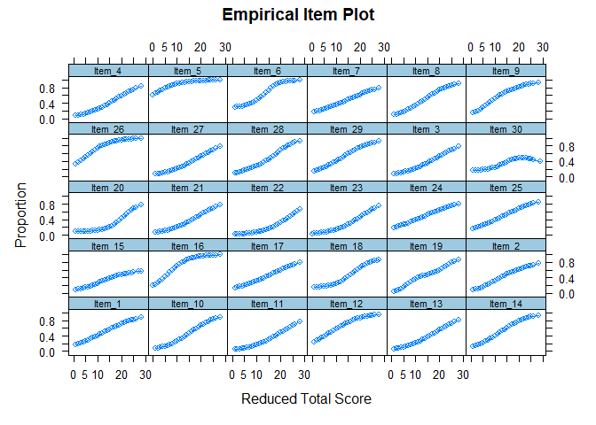

Intro a IRT
================

# Introducción:

La teoría de respuesta al ítem TRI (o IRT en inglés) es una familia de modelos estadísticos que buscan explicar el fenómeno de la medición y evaluación de constructos en áreas de las ciencias sociales. Como cualquier modelo estadístico, parte del supuesto de que los datos observados son producto de algún proceso probabilístico, y una serie de elementos desconocidos que producen los datos que observamos. Debemos imaginar que los datos observados son producidos por un mecanismo oculto en una caja negra, y que nunca podemos tener certeza de qué es aquello que genera lo que observamos.Lo que hace el modelo estadístico es proponer una representación formal y condiciones que permitan mostrar la utilidad y/o verosimilitud del modelo en su capacidad de explicar el fenómeno observado. De algún modo, lo que estamos haciendo es postular qué es aquello que está dentro de la caja negra que produce los datos.

Ejemplo:

Aplicamos una prueba en un colegio, y obtenemos una serie de datos que señalan las respuestas correctas e incorrectas de los y las estudiantes. Esta base de datos se vería de la siguiente forma:

``` r
items[1:10,1:12] %>% kable()
```

<table style="width:100%;">
<colgroup>
<col width="8%" />
<col width="8%" />
<col width="8%" />
<col width="8%" />
<col width="8%" />
<col width="8%" />
<col width="8%" />
<col width="8%" />
<col width="8%" />
<col width="9%" />
<col width="9%" />
<col width="9%" />
</colgroup>
<thead>
<tr class="header">
<th align="right">Item_1</th>
<th align="right">Item_2</th>
<th align="right">Item_3</th>
<th align="right">Item_4</th>
<th align="right">Item_5</th>
<th align="right">Item_6</th>
<th align="right">Item_7</th>
<th align="right">Item_8</th>
<th align="right">Item_9</th>
<th align="right">Item_10</th>
<th align="right">Item_11</th>
<th align="right">Item_12</th>
</tr>
</thead>
<tbody>
<tr class="odd">
<td align="right">1</td>
<td align="right">0</td>
<td align="right">0</td>
<td align="right">0</td>
<td align="right">1</td>
<td align="right">1</td>
<td align="right">0</td>
<td align="right">0</td>
<td align="right">0</td>
<td align="right">0</td>
<td align="right">0</td>
<td align="right">0</td>
</tr>
<tr class="even">
<td align="right">0</td>
<td align="right">0</td>
<td align="right">0</td>
<td align="right">0</td>
<td align="right">0</td>
<td align="right">1</td>
<td align="right">0</td>
<td align="right">1</td>
<td align="right">1</td>
<td align="right">0</td>
<td align="right">0</td>
<td align="right">0</td>
</tr>
<tr class="odd">
<td align="right">0</td>
<td align="right">1</td>
<td align="right">0</td>
<td align="right">0</td>
<td align="right">1</td>
<td align="right">1</td>
<td align="right">0</td>
<td align="right">0</td>
<td align="right">0</td>
<td align="right">0</td>
<td align="right">0</td>
<td align="right">1</td>
</tr>
<tr class="even">
<td align="right">0</td>
<td align="right">0</td>
<td align="right">1</td>
<td align="right">0</td>
<td align="right">1</td>
<td align="right">1</td>
<td align="right">0</td>
<td align="right">1</td>
<td align="right">1</td>
<td align="right">0</td>
<td align="right">0</td>
<td align="right">0</td>
</tr>
<tr class="odd">
<td align="right">0</td>
<td align="right">0</td>
<td align="right">0</td>
<td align="right">0</td>
<td align="right">0</td>
<td align="right">0</td>
<td align="right">0</td>
<td align="right">0</td>
<td align="right">0</td>
<td align="right">0</td>
<td align="right">0</td>
<td align="right">1</td>
</tr>
<tr class="even">
<td align="right">0</td>
<td align="right">0</td>
<td align="right">0</td>
<td align="right">0</td>
<td align="right">1</td>
<td align="right">0</td>
<td align="right">0</td>
<td align="right">0</td>
<td align="right">0</td>
<td align="right">0</td>
<td align="right">0</td>
<td align="right">0</td>
</tr>
<tr class="odd">
<td align="right">0</td>
<td align="right">1</td>
<td align="right">0</td>
<td align="right">0</td>
<td align="right">0</td>
<td align="right">0</td>
<td align="right">1</td>
<td align="right">0</td>
<td align="right">0</td>
<td align="right">0</td>
<td align="right">0</td>
<td align="right">0</td>
</tr>
<tr class="even">
<td align="right">0</td>
<td align="right">0</td>
<td align="right">0</td>
<td align="right">0</td>
<td align="right">1</td>
<td align="right">0</td>
<td align="right">0</td>
<td align="right">0</td>
<td align="right">0</td>
<td align="right">0</td>
<td align="right">0</td>
<td align="right">0</td>
</tr>
<tr class="odd">
<td align="right">0</td>
<td align="right">1</td>
<td align="right">0</td>
<td align="right">0</td>
<td align="right">1</td>
<td align="right">0</td>
<td align="right">0</td>
<td align="right">0</td>
<td align="right">0</td>
<td align="right">0</td>
<td align="right">1</td>
<td align="right">0</td>
</tr>
<tr class="even">
<td align="right">1</td>
<td align="right">0</td>
<td align="right">0</td>
<td align="right">1</td>
<td align="right">1</td>
<td align="right">0</td>
<td align="right">0</td>
<td align="right">0</td>
<td align="right">1</td>
<td align="right">1</td>
<td align="right">0</td>
<td align="right">1</td>
</tr>
</tbody>
</table>

Al observar estos datos podemos suponer varias cosas. Los estudiantes tienen habilidades diversas, y a mayor habilidad, mayor puntaje en la prueba. También podemos suponer razonablemente que hay ítems más fáciles y más difíciles, y que para un estudiante de cierto nivel de habilidad, el ítem fácil será contestado con mayor probabilidad que el ítem difícil. Esta idea puede llevarse al plano del modelamiento estadístico de forma razonable: personas e ítems tienen características que se relacionan mutuamente y cuyo cruce (habilidades y dificultades) debería poder expresarse en términos de probabilidades.

¿Podemos descriptivamente entender esto de algún modo?

Podríamos pensar que si agrupamos a las personas que obtienen el mismo puntaje en la prueba y ordenamos esos grupos de menor puntaje a mayor puntaje, observaremos que la proporción de quienes contestan correctamente un ítem va aumentando. Esto, porque un mayor puntaje indica mayor habilidad, y creemos que aquello debe traducirse en que a mayor puntaje del grupo, mayor proporción de personas contesta correctamente.

``` r
empirical_plot(items[,1:30], which.items = 1:30, smooth = T)
```



## Modelo IRT:

El modelo de teoría de respuesta al ítem busca explicar, concretamente, la probabilidad de que, dado un nivel de habilidad, uno observe una respuesta correcta en un ítem. Esta formula se escribe de la siguiente manera:

$$ p(x=1|\\theta,\\delta) = \\frac{e^{(\\theta-\\delta)}}{1+e^{(\\theta-\\delta)}}  $$
